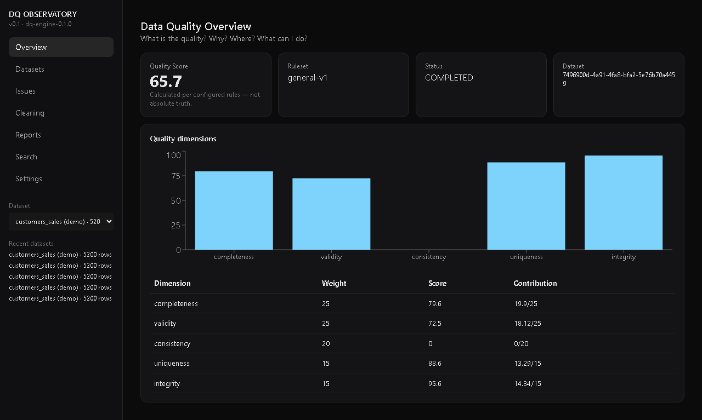
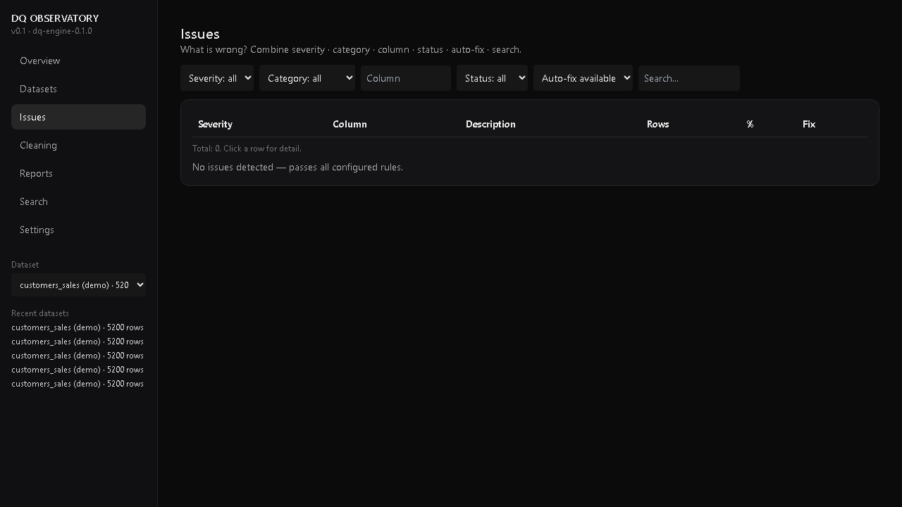
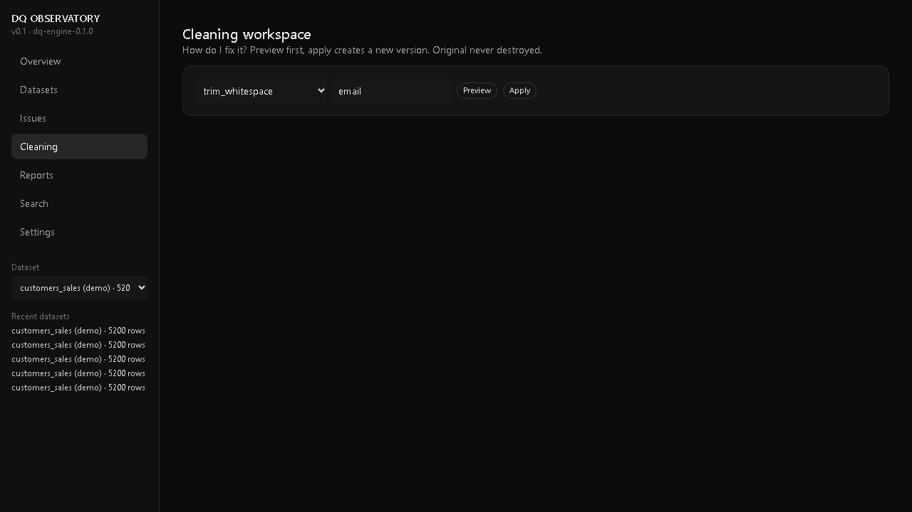
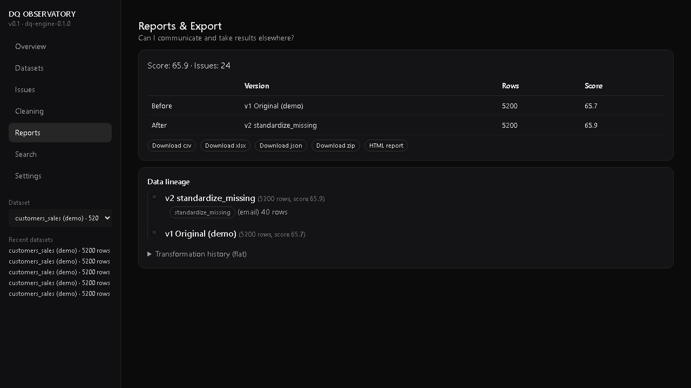
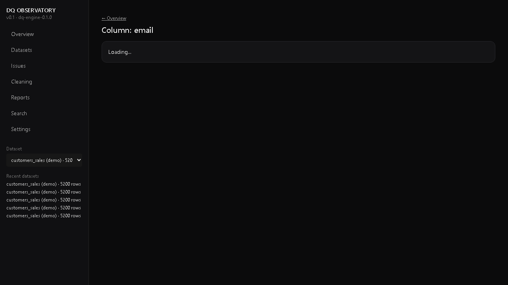
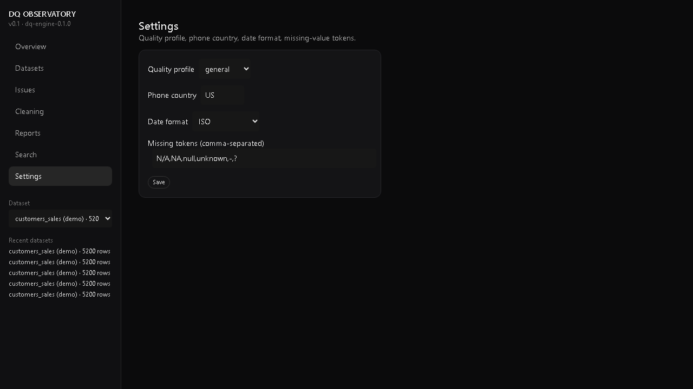
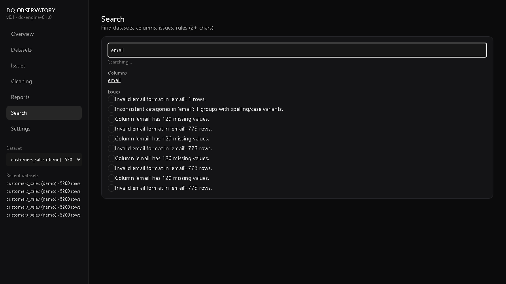
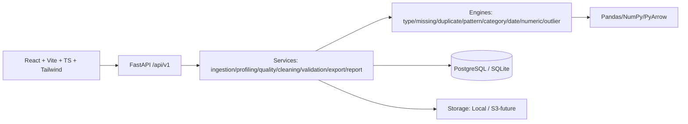

<div align="center">

# 🔭 DQ Observatory

**Understand the quality of your data before it reaches production.**

Profile, validate, clean and monitor tabular datasets with a transparent data quality engine.

[](backend/tests)
[](frontend/dist)
[](frontend/e2e)
[](LICENSE)
[](docs/architecture.md)
[](backend/requirements.txt)
[](frontend/package.json)

`Analyze a dataset` · `Try demo dataset` — [`data/demo/customers_sales.csv`](data/demo/customers_sales.csv) (5200 rows, score ~66/100, 23 issues)

</div>

---

## 📖 Table of Contents

- [✨ Features](#-features)
- [📸 Screenshots](#-screenshots)
- [🚀 Quickstart](#-quickstart)
- [📖 Usage](#-usage)
- [🛠️ API Reference](#️-api-reference)
- [🏗️ Architecture](#️-architecture)
- [🐳 Deployment](#-deployment)
- [🧪 Testing & Benchmarks](#-testing--benchmarks)
- [🔒 Security](#-security)
- [🗺️ Roadmap](#️-roadmap)
- [⚠️ Limitations](#️-limitations)
- [🤝 Contributing](#-contributing)
- [📄 License](#-license)

---

## ✨ Features

| Area | What you get |
|------|--------------|
| 📤 **Ingest** | Upload CSV / XLSX / XLS / JSON (extension + MIME + size + encoding checks, hash, versioning) |
| 🔍 **Profiling** | Deterministic engine: physical/semantic types + confidence, missing matrix, exact + subset duplicates, email/phone/URL/UUID/currency/% detectors, categories, ambiguous DD/MM dates, numerics-as-text, outliers (IQR/Z), PII hints, constant / high-cardinality / identifier detection |
| ⚡ **Scale** | Parallel profiling for >10k rows (chunked processing + systematic / random / stratified sampling) |
| 💯 **Quality Score** | Transparent formula: completeness 25 + validity 25 + consistency 20 + uniqueness 15 + integrity 15, with per-dimension contributions |
| 🐛 **Issues** | Explorer with severity / category / column / status / auto-fix / search + pagination, detail drawer, one-click fix |
| 🧹 **Cleaning** | Workspace with before/after preview → apply → new version, undo via lineage, reset to v1, audit log |
| ✅ **Validation** | Structured rule DSL (`between` / `gte` / `in` / `regex` / `valid_email` / …) — no `eval`/`exec` |
| 📊 **Observability** | Column health table + column detail page, global search, quality trend across versions |
| 📉 **Drift** | Schema drift + distribution drift between versions (KS test, PSI, KL divergence, χ², per-column severity) |
| 🔗 **Correlations** | Pearson / Spearman / Kendall, Cramér's V, Theil's U, correlation ratio, high-correlation groups |
| ⏰ **Jobs & Webhooks** | Scheduled jobs with `quality_run` handler (cron, manual trigger, history, pause/resume) + HMAC-signed webhooks (`quality_run_completed`, `job_failed`, `drift_detected`…) with exponential-backoff retry |
| 📜 **Governance** | Data contracts + breaking-change checks (schema required / type-change, SLA `min_score`) with history · AutoML validation rules (`POST /{id}/auto-rules`) · Lineage DAG · Real-time quality stream (`WS /api/v1/stream/quality/{id}`) |
| 🔐 **RBAC** | Roles owner / admin / editor / viewer via `X-Role` header (JWT-ready), permissions enforced on jobs/webhooks |
| 📦 **Exports** | CSV / XLSX (formula-injection sanitized) / JSON / Parquet (Snappy) / Delta Lake (zipped) / Avro / ZIP bundle (cleaned + report + issues + transformations + schema + README) — with column selection, filters (`eq/ne/gt/gte/lt/lte/in/contains`) and date ranges |
| 🧭 **Guided tour** | Button **▶ Recorrido**: 6 steps (nav → dataset → drift → correlations → jobs → webhooks), progress bar, step dots, `Esc` exits, resumes from last step |

---

## 📸 Screenshots

| Overview | Issues + auto-fix | Cleaning | Reports before/after |
|----------|-------------------|----------|----------------------|
|  |  |  |  |

| Column detail | Settings | Search |
|---------------|----------|--------|
|  |  |  |

> More captures in [`screenshots/`](screenshots/) — issue detail, fix applied, HTML report, ZIP export.

---

## 🚀 Quickstart

### Option A — One command (Windows, recommended)

```powershell
powershell -ExecutionPolicy Bypass -File scripts/start-demo.ps1
```

Starts backend `:8000` + frontend `:5173`, seeds the demo dataset and prints the URLs. No Docker needed (SQLite by default).

### Option B — Manual (any OS)

```bash
# Backend
python -m venv .venv && source .venv/bin/activate  # windows: .venv\Scripts\activate
python -m pip install -r backend/requirements.txt
copy .env.example backend/.env                      # windows — linux/mac: cp .env.example backend/.env
python scripts/generate_demo_data.py
cd backend && python -m uvicorn app.main:app --reload --port 8000

# Frontend (new terminal)
cd frontend && npm install && npm run dev           # http://localhost:5173
```

Env vars (`backend/.env`): `DATABASE_URL` · `STORAGE_PATH` · `MAX_UPLOAD_SIZE_MB` · `CORS_ORIGINS` · `LOG_LEVEL`. See [`.env.example`](.env.example).

### Option C — Docker

```bash
docker compose up --build   # frontend :5173 · backend :8000 · postgres :5432
```

### Option D — Public link (share your demo)

```bash
cloudflared tunnel --url http://localhost:5173
# → https://<random>.trycloudflare.com  (ephemeral, free, no account)
```

For a permanent URL, deploy to Render (see [Deployment](#-deployment)).

---

## 📖 Usage

**The 2-minute tour** (works with the demo dataset, no upload needed):

```bash
# 1. Seed the chaos dataset (5000 rows + 200 duplicates, deliberate real-world errors)
curl -X POST http://localhost:8000/api/v1/datasets/demo/seed
# → {"id":"<DATASET_ID>", ...}

# 2. Run quality scoring
curl http://localhost:8000/api/v1/datasets/<DATASET_ID>/quality
# → {"score":65.7,"dimensions":{...}}   # ~66/100, 23 issues expected

# 3. Explore issues, then auto-fix one
curl "http://localhost:8000/api/v1/datasets/<DATASET_ID>/issues?severity=high"
curl -X POST http://localhost:8000/api/v1/issues/<ISSUE_ID>/fix

# 4. Clean with preview, then apply
curl -X POST http://localhost:8000/api/v1/datasets/<DATASET_ID>/clean \
  -H 'Content-Type: application/json' \
  -d '{"operation":"trim_whitespace","column":"customer_name","preview_only":true}'

# 5. Export the cleaned dataset + full audit bundle
curl -o clean.zip "http://localhost:8000/api/v1/datasets/<DATASET_ID>/export?format=zip"
```

**In the UI** (`http://localhost:5173`): Upload → Overview (score) → Issues (filter + fix) → Column detail → Cleaning (preview → apply → v2) → Drift / Correlations → Reports (before/after + executive summary) → Export. Or press **▶ Recorrido** for the guided 6-step tour.

Full guides: [`docs/data-quality.md`](docs/data-quality.md) · [`docs/quality-score.md`](docs/quality-score.md) · [`docs/cleaning-engine.md`](docs/cleaning-engine.md) · [`docs/validation.md`](docs/validation.md)

---

## 🛠️ API Reference

Base: `/api/v1` · Interactive docs: `http://localhost:8000/docs`

| Method & path | Description |
|---------------|-------------|
| `POST /datasets` | Upload CSV/XLSX/JSON |
| `POST /datasets/demo/seed` | Seed the demo chaos dataset |
| `GET /datasets/{id}` | Dataset detail |
| `POST /datasets/{id}/profile` | Run profiling |
| `GET /datasets/{id}/columns/{col}` | Column detail |
| `POST /datasets/{id}/quality/run` · `GET /datasets/{id}/quality` | Score + trend (`GET …/quality/trend`) |
| `GET /datasets/{id}/issues` · `POST /issues/{id}/fix` | Issues explorer + auto-fix |
| `POST /datasets/{id}/clean` | Cleaning (supports `preview_only`) |
| `POST /datasets/{id}/validate` | Run validation ruleset |
| `GET /datasets/{id}/versions` · `GET /datasets/{id}/report(.html)` | Versions + reports |
| `GET /datasets/{id}/export?format=csv\|xlsx\|json\|parquet\|delta\|avro\|zip&columns=&filter_col=&filter_op=&filter_val=&date_start=&date_end=&date_column=` | Filtered exports |
| `GET /{id}/drift?from_version=&to_version=` · `GET /{id}/correlations` | Drift + correlations |
| `POST\|GET\|PATCH /jobs` + `/jobs/{id}/run\|pause\|resume` | Scheduled jobs |
| `POST\|GET\|PATCH\|DELETE /webhooks` | Webhooks |
| `POST\|GET\|PATCH /contracts` + `/contracts/check` + `/contracts/checks` | Data contracts |
| `POST /{id}/auto-rules` | AutoML validation rules |
| `GET /datasets/{id}/lineage/graph` | Lineage DAG |
| `WS /stream/quality/{id}` | Real-time quality stream |
| `GET /search?q=…` · `GET /health` · `GET /ready` | Search + probes |

See [`docs/api.md`](docs/api.md) for details.

---

## 🏗️ Architecture



Deep dive: [`docs/architecture.md`](docs/architecture.md)

---

## 🐳 Deployment

| Target | How |
|--------|-----|
| **Local** | `scripts/start-demo.ps1` (Windows) or manual Quickstart — uvicorn + vite, SQLite |
| **Docker Compose** | `docker compose up --build` (backend/frontend/postgres) |
| **Render** | Blueprint [`render.yaml`](render.yaml): backend Python (`pip install -r backend/requirements.txt`, `uvicorn app.main:app --app-dir backend --host 0.0.0.0 --port $PORT`, health `/health`) + frontend Static (`npm ci && npm run build`, publish `frontend/dist`) + Postgres free. Set `DATABASE_URL`, `CORS_ORIGINS`. |

Details: [`docs/deployment.md`](docs/deployment.md)

---

## 🧪 Testing & Benchmarks

```bash
# Backend — 27 tests (engines, API E2E, demo ranges, exports, RBAC, scheduler, webhooks, governance…)
cd backend && python -m pytest -q

# Benchmarks (measured)
$env:PYTHONPATH='backend'; python scripts/benchmark.py
# 1k rows → 2.34s / 0.87MB / score 67.6 / 22 issues
# 5.2k rows → 7.5s / 4.51MB / score 65.7 / 23 issues

# Frontend build
cd frontend && npm run build   # PASS ~13s, 891 modules, lazy chunks

# E2E (Playwright) — 6 tests: journey, tour, nav, RBAC, pause/resume, drift validation
cd frontend && npx playwright test
```

---

## 🔒 Security

File validation (extension + MIME + size + encoding) · safe filenames · path-traversal guard · parameterized ORM · CSV-formula-injection sanitize (`= + - @` → `'…`) · no `eval`/`exec`/shell · XSS-safe (values never executed) · CORS allowlist · no secrets in logs · temp cleanup. Details: [`docs/security.md`](docs/security.md)

---

## 🗺️ Roadmap

- [x] **V1** — upload / profiling / score / issues / cleaning / validation / export / reports
- [ ] **V2** — mapper / contracts / scheduled jobs
- [ ] **V3** — AI assistant (deterministic context, no exec)
- [ ] **V4** — pipeline builder
- [ ] **V5** — enterprise observability

See [`docs/roadmap.md`](docs/roadmap.md)

---

## ⚠️ Limitations

Sync path is best for ≤100k rows; larger sets need chunk/jobs (statuses `QUEUED`/`PROCESSING`/… scaffolded). No real email-existence check. Phone canonicalization is configurable by country. Ambiguous dates are flagged, never silently resolved.

---

## 🤝 Contributing

1. Fork → branch (`feat/…` / `fix/…`) → PR with a clear description
2. Backend: `cd backend && python -m pytest -q` must stay green (27/27)
3. Frontend: `cd frontend && npm run build` must pass; add a Playwright test for user-facing flows
4. Follow the existing DSL/style — deterministic engines, no `eval`/`exec`, sanitize exports

---

## 📄 License

MIT — see [LICENSE](LICENSE).

---

<div align="center">

**[⬆ back to top](#-dq-observatory)**

Built with FastAPI · React · Pandas — *know your data before production does.*

</div>
